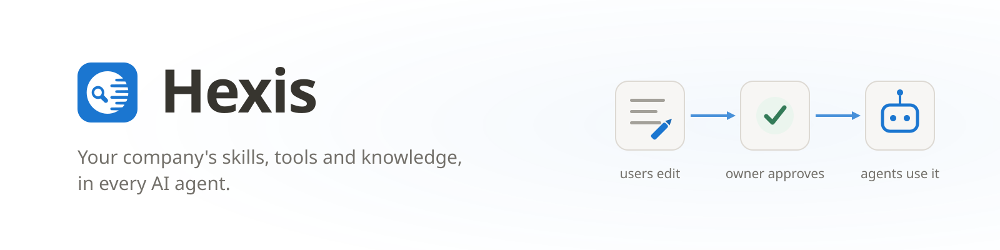
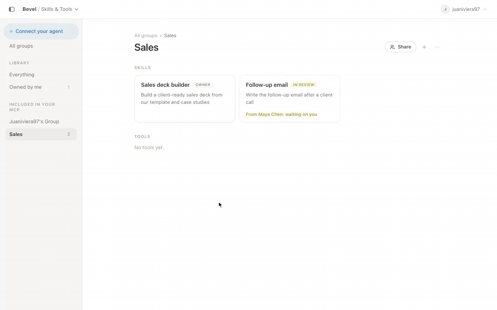
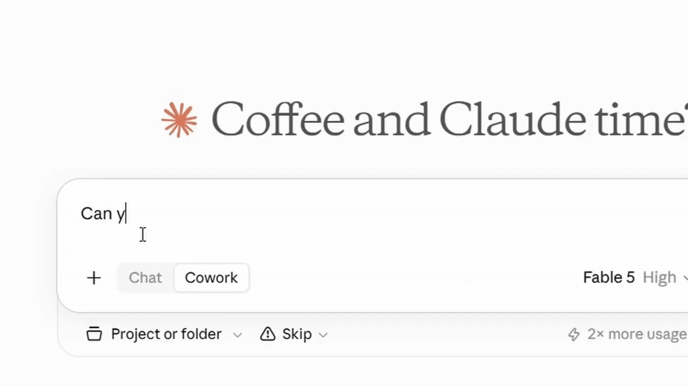
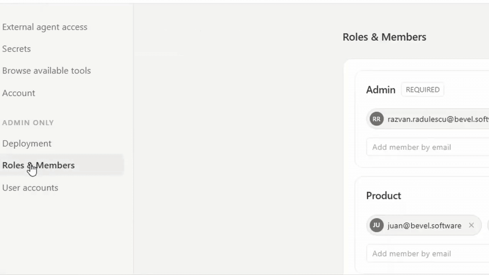

<p align="center">
  
</p>

<p align="center">
  <a href="https://github.com/Bevel-Software/Hexis/stargazers"></a>
  <a href="https://demo.bevel.software/workspace/main/knowledge-base/KnowledgeBase/Start%20here.md"></a>
  <a href="LICENSE"></a>
  <a href="https://github.com/Bevel-Software/Hexis/commits"></a>
</p>

One place where your company's **AI plugins, tools and knowledge** live:
centrally managed, reviewed and access-controlled, and usable from **any AI
agent**. The open-source core of the Bevel platform.

- **Every employee connects once, in minutes.** They add the workspace to
  Claude Code, ChatGPT, Cursor or any MCP-capable agent with a single
  connection key, and their agent can use exactly the skills, tools and
  knowledge their role allows. No per-tool credentials handed around, no
  per-agent setup projects.
- **The company stays in control.** Skills, tool access and knowledge are
  managed and reviewed in one place: every change has an author and a way
  back, and anything proposed through a change request reaches its owners
  for review before it lands. The rules apply to agents exactly as they
  apply to people.
- **Independent of any agent vendor.** Because the workspace speaks open
  protocols, you can switch agent vendors on price and performance, or mix
  them by task and role, without rebuilding what your agents know and can do.
  The investment lives with you, not inside one vendor's walls. That is what
  makes enterprise agent rollouts fast: onboard the next team, or the next
  agent, instead of starting over.

Under the hood, everything lives in a **git repository you own**, on any git
host: skills (`SKILL.md` folders), tool (such as MCP servers) with an encrypted
secrets vault, and knowledge. You get branches, change requests with owner
approval, role-based access, and a built-in remote MCP server (OAuth 2.1)
that agents connect to.

## Contents

- [See Hexis in action](#see-hexis-in-action)
- [Connect Hexis to Cline](#connect-hexis-to-cline)
- [Try the live demo](#try-it-first-the-live-demo)
- [Managed hosting](#want-a-managed-instance)
- [Deploy with Docker](#deploy-it-in-5-minutes-docker)
- [Local development](#local-development-run-from-source)
- [Environment reference](#environment-reference)
- [Troubleshooting](#troubleshooting)
- [Repository layout](#repository-layout)

[](https://youtu.be/RjOWRz4E0ZU?si=R7d8rT_P1YVxmQBO)

*Watch the full walkthrough: connect an agent, use company context, review
proposed changes, and manage team access.*

## See Hexis in action

### Propose and approve skill changes

Anyone can propose a new skill or improve an existing one. On protected
branches, owners review the exact change and approve it before it becomes
available to the team's agents.



### Use your team's skills in Claude

Connect Claude to Hexis over MCP, then ask normally. Claude can discover and
load the approved skill instructions and company context your role can access,
without copying prompts between tools.



### Connect Hexis to Cline

Cline can connect directly to Hexis as a remote Streamable HTTP MCP server.
Install the public demo connection from the Cline CLI:

```sh
cline mcp install hexis --transport http https://demo.bevel.software/api/mcp --yes
```

Complete the OAuth sign-in in your browser when prompted. Cline then discovers
the skills, tools and context your Hexis role can access. For your own Hexis
deployment, replace `demo.bevel.software` with your deployment's host.

### Share skills with the right people

Add teammates to roles or grant access directly when needed. Everyone connects
to the same workspace, while each person and their agent only sees what they
are allowed to read.



## Try it first: the live demo

**[demo.bevel.software](https://demo.bevel.software/workspace/main/knowledge-base/KnowledgeBase/Start%20here.md)**
is a public instance you can sign into with your Google account, populated
with a fictional company's knowledge, skills and tools. The *Start here* page
walks you through the whole loop: connect your own agent over MCP, have it
build a sales deck from a skill, watch its proposed improvement arrive as a
change request. The demo is shared and read-mostly (visitors propose, owners
approve); everything below gets you the same thing with none of the limits.

## Want a managed instance?

We run it for you (hosting, upgrades, backups, SSO) and your team just signs
in. Write to **[ali.raza@bevel.software](mailto:ali.raza@bevel.software)**.

## Deploy it in 5 minutes (Docker)

You need: [Docker](https://docs.docker.com/get-docker/) with Compose on a
server (or your laptop; one line below differs), and an
**empty git repository** on any host (GitHub, GitLab, Bitbucket, Azure DevOps,
self-hosted) to hold your knowledge base. The app seeds it with a starter
template on first run.

```sh
git clone https://github.com/Bevel-Software/Hexis.git
cd Hexis
cp .env.example .env
```

Open `.env` and fill in the **four required values** (everything else can wait):

```sh
ADMIN_EMAIL=you@example.com     # the deployment owner, always an admin
ADMIN_PASSWORD=pick-something   # sign-in password; only with password login (SSO-only deployments drop it, see below)
JWT_SECRET=…                    # generate with the command below
SECRETS_ENC_KEY=…               # generate with the command below
```

Generate the two secrets (run twice, paste one result into each):

```sh
node -e "console.log(require('crypto').randomBytes(32).toString('base64'))"
# no Node installed? docker run --rm node:22-slim node -e "console.log(require('crypto').randomBytes(32).toString('base64'))"
```

For a public deployment, also set the origin values:

```sh
PUBLIC_BACKEND_URL=https://bevel.your-domain.com   # public origin; OAuth redirects are built from it
PUBLIC_FRONTEND_URL=https://bevel.your-domain.com  # same origin: the backend serves the SPA
```

Then start everything (Postgres + the app). **Behind a reverse proxy**
(Coolify, Traefik, nginx; recommended):

```sh
docker compose -f docker-compose.yml up -d
```

Also set `TRUST_PROXY` to your proxy hop count (`1` for a single proxy), so
rate limits see real client IPs instead of the proxy's.

The explicit `-f` skips `docker-compose.override.yml`, so the app publishes
**no host port**: your proxy reaches it on port `3001` over the compose
network. This is deliberate: a fixed published port makes every redeploy fail
with `port is already allocated`, because the replacement container starts
while the outgoing one still holds it.

**Directly exposed** (no proxy): plain `docker compose up -d` publishes
`:3001`; use `APP_PORT=8080 docker compose up -d` for a different host port.
Leave `TRUST_PROXY` unset here. With no proxy in front, trusting forwarded
headers would let clients spoof their own address.

Open your domain and sign in with `ADMIN_EMAIL` / `ADMIN_PASSWORD`.

**Just trying it on your laptop?** Same steps, minus the origin values: plain
`docker compose up -d`, then open **http://localhost:3001**.

### First sign-in: the setup screen

The app asks for the things it could not guess, and **tests them against the
real host before saving**:

1. **Knowledge-base repo**: the https clone URL of that empty repository.
2. **Git credential**: a token with read/write access to it (for GitHub: a
   fine-grained personal access token with *Contents: read & write* on that one
   repo is enough).
3. **Branch model**: which branch is the default and which are protected
   (changes to protected branches only land through approved change requests).
   The repository's real branches are offered as suggestions; for an empty repo
   the default (`main`) is fine.

Since the repo is empty, the app initialises it from the bundled template and
writes a `roles.yaml` whose first Admin is you. That's it: you're in the
workspace. Head to **Skills & Tools** to make your first plugin and skill, and to
**Connect** (in the app menu) to hook up an agent over MCP.

Prefer configuring by environment instead of the setup screen? Every one of
those values has an env var (`KB_REPO_URL`, `GIT_TOKEN`, `DEFAULT_BRANCH`, …);
anything set in the environment wins over the setup screen. See
[`.env.example`](.env.example).

Worth knowing in production:

- **State that survives redeploys**: Postgres data plus three app volumes
  (workspace clones, diff-review backups, tool-chain spill files) are named
  volumes, so a redeploy or image rebuild loses nothing. Back up the `pgdata`
  volume and your knowledge-base git repo; everything else is derivable.
- **Health**: `GET /api/health`. First boot can take a minute or two while it
  runs migrations and seeds the knowledge-base repo.
- **Single sign-on**: set `OIDC_ISSUER_URL` / `OIDC_CLIENT_ID` /
  `OIDC_CLIENT_SECRET` (any spec-compliant provider) or configure it on the
  setup screen, which shows you the redirect URI to register. For SSO-only
  deployments set `LOGIN_PASSWORD=false` and drop `ADMIN_PASSWORD`. If your
  issuer is multi-tenant (Google, Entra `common`), set
  `ALLOWED_EMAIL_DOMAINS`. SSO auto-provisions accounts, and that list is the
  only signup boundary.

## Local development (run from source)

You need: **Node 22** (`.nvmrc`; the engine range is `>=22 <23`),
**pnpm 10**, **git ≥ 2.41**, and a Postgres 17 (the bundled one is fine):

```sh
docker compose up -d db        # just the database
pnpm install
pnpm build                     # builds the packages the apps import
cp .env.example .env           # fill the same four required values;
                               # the default DATABASE_URL already points at the bundled db
pnpm dev                       # backend on :3001, Vite dev server on :5173
```

Open **http://localhost:5173** (the dev server proxies to the backend). Useful
commands: `pnpm test`, `pnpm typecheck`, `pnpm lint`.

Migrations run automatically on boot; there is no separate migrate step, in
dev or in production.

## Environment reference

The four **required** values, then the rest. Everything marked *setup screen*
can be left unset and configured in the app at first sign-in (env always wins).
[`.env.example`](.env.example) documents every variable in full.

| Variable | Required | Purpose |
| --- | --- | --- |
| `ADMIN_EMAIL` | yes | Deployment owner: always an admin, and the initial Admin of a freshly seeded KB |
| `ADMIN_PASSWORD` | with password login | Bootstrap sign-in password, checked against the env and never stored. Not needed when `LOGIN_PASSWORD=false` |
| `JWT_SECRET` | yes | Signs login sessions + OAuth state |
| `SECRETS_ENC_KEY` | yes | 32-byte key (base64/hex) encrypting vault secrets + MCP OAuth tokens |
| `DATABASE_URL` | see note | Postgres connection string. Unset under compose, the app builds it from the `POSTGRES_*` values the bundled db was created with |
| `POSTGRES_USER` / `POSTGRES_PASSWORD` / `POSTGRES_DB` | no | Credentials for the bundled database (applied only when its volume is first created) |
| `KB_REPO_URL` | setup screen | https clone/push URL of the knowledge-base repo, on any git host |
| `GIT_TOKEN` / `GIT_USERNAME` | setup screen | Git credential (HTTP Basic password / host-specific username; see `.env.example` for per-host usernames) |
| `DEFAULT_BRANCH` / `PROTECTED_BRANCHES` | setup screen | Branch model. Runtime-only: served to the frontend over `/api/config`, so one build runs anywhere |
| `PUBLIC_BACKEND_URL` / `PUBLIC_FRONTEND_URL` | production | Public origins for OAuth redirects + post-login bounces |
| `TRUST_PROXY` | behind a proxy | Reverse-proxy hop count, so `req.ip` and the login rate limit see the real client |
| `OIDC_ISSUER_URL` / `OIDC_CLIENT_ID` / `OIDC_CLIENT_SECRET` | no | Generic OIDC SSO; the login method appears once all three are set |
| `ALLOWED_EMAIL_DOMAINS` | with multi-tenant SSO | Signup allow-list for SSO auto-provisioning |
| `LOGIN_PASSWORD` | no | `false` hides password login and rejects the endpoint |
| `PORT` | no | Backend port (default 3001) |
| `KB_DIR_NAME` | no | Directory name of the KB clone inside each workspace |
| `TENANT_ID` | no | Slug branding credential prefixes (default `bevel`) |
| `KB_TEMPLATE_DIR` | no | Overrides the packaged KB seed template |
| `ONTOLOGY_SESSION_BLOCK` | no | Ontology-session touch tracking toggle (default on) |

## Troubleshooting

- **`port is already allocated` on redeploy**: you're behind a proxy but ran
  compose without `-f docker-compose.yml`, so the override published a host
  port. Deploy with the explicit `-f` (see above).
- **Changed `POSTGRES_PASSWORD` but can't connect**: Postgres applies those
  values only when its data volume is **first** created. In dev,
  `docker compose down -v` resets it; in production, change the password in
  the database itself.
- **`pnpm install` fails on Node version**: the engine range is strict
  (`>=22 <23`) because of a native dependency's ABI. `nvm use` picks up
  `.nvmrc`.
- **Setup screen rejects the git token**: the token needs read *and* write
  (push) access to the KB repository; the setup screen's test tells you which
  half failed. On GitHub, fine-grained tokens also need the repo explicitly
  selected.
- **Changed `ADMIN_PASSWORD` and nothing happened**: it's read once at
  startup; restart the app container.
- **App unhealthy right after first start**: give it the `start_period`
  (~90s); first boot runs migrations and seeds the KB repo before answering.

## Repository layout

| Path | What it is |
| --- | --- |
| `packages/shared` | `@bevel-software/platform-shared`: shared types + pure domain utilities |
| `packages/core-backend` | `@bevel-software/platform-core-backend`: the core backend (ships `migrations/` + `kb-template/`) |
| `packages/core-frontend` | `@bevel-software/platform-core-frontend`: the core UI, published as raw TS/TSX source |
| `apps/server` | standalone core backend shell |
| `apps/web` | standalone core SPA shell (Vite) |

License: [Apache-2.0](LICENSE)
